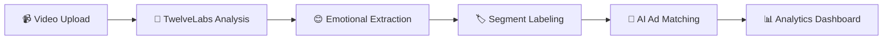

<div align="center">


# VibePoint Ad Tool

### *Helping creators intelligently insert ads in online videos and vibes*

[](https://devpost.com/software/vibe-point)
[](https://youtu.be/KrvGulPdHGQ)
[](https://www.twelvelabs.io/)

An AI-powered platform that analyzes viewer reactions and emotional beats in videos to dynamically select and place contextually relevant ads.

[🚀 Watch Demo](https://youtu.be/KrvGulPdHGQ) • [📝 Devpost](https://devpost.com/software/vibe-point) • [🏆 Hackathon](https://gen-ai-advertising-nyc.devpost.com/)

</div>

---

## 🎥 Demo Video

<div align="center">
  <a href="https://youtu.be/KrvGulPdHGQ">
    
  </a>
  <p><em>Click to watch our full demo on YouTube</em></p>
</div>

---

## 🏆 About the Hackathon

<table>
<tr>
<td width="60%">

**Generative AI in Advertising Hackathon**
📍 Betaworks, New York City
📅 October 4-5, 2025
💰 AdWeek NYC

VibePoint was built to transform the **$800B advertising industry** with AI, addressing the **Identity & Contextual Advertising** challenge.

🎯 **Our Focus**: Leveraging TwelveLabs' video understanding APIs to create an enterprise-ready solution that connects emotional context with advertising effectiveness.

</td>
<td width="40%">

**Challenge Categories:**
- 🎨 Creative & Production
- 🛡️ Brand Safety & Suitability
- 🎯 **Identity & Contextual Ads**
- 📊 Performance Insights

</td>
</tr>
</table>

---

## ✨ What It Does

<div align="center">



</div>

VibePoint uses a **dual-agent system** to revolutionize video advertising:

| Feature | Description |
|---------|-------------|
| 🎭 **Emotional Analysis** | Detecting viewer reactions and emotional beats using 12Labs' advanced video understanding |
| 🏷️ **Smart Categorization** | Organizing content into emotional moments and segments |
| 🎯 **Dynamic Ad Placement** | Selecting ads based on emotional context, not demographics |
| 📈 **Engagement Prediction** | Simulating viewer responses to predict ad performance |
| 📊 **Analytics Dashboard** | Comprehensive performance insights through an interactive interface |

---

## 💡 The Problem & Solution

<table>
<tr>
<td width="50%">

### ❌ The Problem

Modern video advertising faces critical challenges:

- 🚫 **Irrelevant ads** disrupt viewer experience
- 📉 **Poor targeting** fails to capture emotional engagement
- 💔 **Context blindness** ignores content emotional tone
- 📊 **Weak metrics** don't measure true resonance

</td>
<td width="50%">

### ✅ Our Solution

VibePoint bridges the gap between creators and advertisers:

- 🎯 **Context-aware** ad placement
- 😊 **Emotional alignment** with content
- 🤝 **Natural integration** enhances experience
- 📊 **Resonance metrics** measure true impact

</td>
</tr>
</table>

---

## 🏗️ Architecture

<div align="center">

```
┌─────────────────────────────────────────────────────────────────┐
│                      📹 Video Input Layer                        │
└───────────────────────────────┬─────────────────────────────────┘
                                │
                                ▼
┌─────────────────────────────────────────────────────────────────┐
│              🧠 Emotional Extraction Layer (12Labs)              │
│                  Analyzes emotional signals                      │
└───────────────────────────────┬─────────────────────────────────┘
                                │
                                ▼
┌─────────────────────────────────────────────────────────────────┐
│                  🏷️ Segment Labeling Engine                      │
│              Categorizes emotional moments                       │
└───────────────────────────────┬─────────────────────────────────┘
                                │
                                ▼
┌─────────────────────────────────────────────────────────────────┐
│               🤖 AI-Powered Ad Matching (GPT)                    │
│            Matches ads to emotional context                      │
└───────────────────────────────┬─────────────────────────────────┘
                                │
                                ▼
┌─────────────────────────────────────────────────────────────────┐
│              📈 Viewer Response Simulation                       │
│          Predicts emotional resonance                            │
└───────────────────────────────┬─────────────────────────────────┘
                                │
                                ▼
┌─────────────────────────────────────────────────────────────────┐
│                  📊 Analytics Dashboard                          │
│           Visualizes performance metrics                         │
└─────────────────────────────────────────────────────────────────┘
```

</div>

---

## 🎉 Key Accomplishments

<div align="center">

| Achievement | Impact |
|------------|--------|
| 🔗 **Integration Excellence** | Seamlessly connected 12Labs emotional analysis with GPT-based matching |
| 🎯 **Predictive Power** | Built simulation engine that accurately predicts emotional resonance |
| 🤝 **Ethical AI** | Created system that aligns brands with content values |
| 💡 **Paradigm Shift** | Proved emotional context beats demographic targeting |

</div>

---

## 🚀 What's Next

<table>
<tr>
<td width="33%">

### 🎯 Short Term
- Enhance emotional detection precision
- Expand content type coverage
- Improve matching algorithms

</td>
<td width="33%">

### 📈 Medium Term
- Scale platform infrastructure
- Build robust API integrations
- Add real-time processing

</td>
<td width="34%">

### 💼 Long Term
- Strategic partnerships
- Enterprise deployment
- Industry transformation

</td>
</tr>
</table>

---

## 🛠️ Technology Stack

<div align="center">


</div>

<table>
<tr>
<td width="50%">

**Frontend**
- ⚛️ Next.js 15 with App Router
- 📘 TypeScript
- 🎨 Tailwind CSS
- 🧩 shadcn/ui Components

</td>
<td width="50%">

**Backend**
- 🐍 Python 3.12+
- ⚡ FastAPI
- 🎥 TwelveLabs Video API
- 🤖 OpenAI GPT-4
- ☁️ AWS S3

</td>
</tr>
</table>

---

## 📁 Project Structure

```
ny-hackathon-twelvelabs/
├── 🔧 amber_aim/              # FastAPI Backend
│   ├── Video processing
│   ├── Emotional analysis (12Labs)
│   ├── AI ad matching (GPT)
│   └── S3 upload management
│
└── 🎨 amber_aim_web/          # Next.js Frontend
    ├── Analytics dashboard
    ├── Video player
    ├── Upload interface
    └── Ad placement visualization
```

---

## 🚀 Getting Started

<table>
<tr>
<td width="50%">

### 🔧 Backend Setup

```bash
cd amber_aim
uv pip install -e .
uvicorn amber_aim.main:app --reload
```

📖 [Detailed Backend Instructions](./amber_aim/README.md)

</td>
<td width="50%">

### 🎨 Frontend Setup

```bash
cd amber_aim_web
npm install
npm run dev
```

📖 [Detailed Frontend Instructions](./amber_aim_web/README.md)

</td>
</tr>
</table>

---

## 👥 Team

<div align="center">

<table>
<tr>
<td align="center">
<strong>Rob Kleiman</strong>
</td>
<td align="center">
<strong>Sarah Yu</strong>
</td>
<td align="center">
<strong>Leonardo Piñeyro</strong>
</td>
<td align="center">
<strong>Lan Mi</strong>
</td>
</tr>
</table>

Built with ❤️ at AdWeek NYC 2025

</div>

---

## 📄 License

MIT License - see [LICENSE](LICENSE) for details

---

<div align="center">

**⭐ If you found this project interesting, please give it a star!**

[🚀 Watch Demo](https://youtu.be/KrvGulPdHGQ) • [📝 Devpost](https://devpost.com/software/vibe-point) • [🏆 Hackathon](https://gen-ai-advertising-nyc.devpost.com/)

</div>
